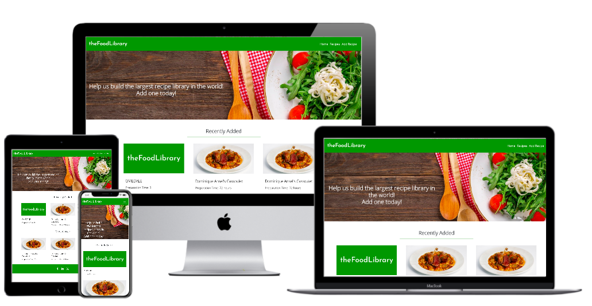

<h1 align="center">theFoodLibrary</h1>

<h2 align="center"> MS3 - Data Centric Development - Code Institute </h2>

[Click here for a live demo version of this project.](https://the-food-library.herokuapp.com/)

This project is a recipes dictionary. The main goal is to make it possible for the users to find, add, update/edit and delete recipes. 

## User Experience (UX)

-   ### User stories
    
    -   #### User Goals
        
        1. As a User, I want to easily understand the purpose of the website.
        2. As a User, I want to be able to have access to all the recipes.
        3. As a User, I want to be able to add a new recipe.
        4. As a User, I want to be able to update/edit or delete a recipe.
        5. As a User, I want to be able to search for any recipe by name.
        
    -   #### Frequent User Goals
        
        1. As a Frequent User, I want to be able to check if there are any new recipes added.
        2. As a Frequent User, I want to be able to check which recipes are the most viewed.
       
        
-   ### Design

    -   #### Colour Scheme
        -   The colour used in this project is green - specifically #269014. I picked this colour because it is often used in food related websites and it is also a warm and very friendly colour to look at. 
        
    -   #### Typography
        -   The font-family "Josefine Sans" is the one used for the logo. For the website content the font-family used is "Open Sans". Sans Serif is the fallback font used in case  'Josefin Sans' and/or "Open Sans" are not being imported into the project correctly.

    -   #### Imagery
        -   All the images are food related. The user can add an image for each and every added recipe by adding a URL to the image field. If the user does not supply a image URL, a default image (website logo) will be displayed instead.
        
## Features

-   Responsive on all device sizes

-   The user has access to all the recipes by clicking on the "Recipes" button on the navigation bar. The recipes are displayed on cards that include a recipe image(or default image), recipe name and preparation time. 

-   There are 6 recipe cards displayed per page, at the bottom of the "Recipes" page the user can use the arrows to move the previous or next page of recipes.

-   The user can add a new recipe by clicking on the "Add Recipe" button on the navigation bar.

-   The user can edit/update or delete a recipe by clicking on the "edit" or "delete" buttons, respectively. The buttons can be found at the bottom of each recipe page.

-   The user can use a search bar to look for a recipe by name. The search bar is located in the "Recipes" page, above the recipe cards.

## Technologies Used

### Languages Used

-   [HTML5](https://en.wikipedia.org/wiki/HTML5)
-   [CSS3](https://en.wikipedia.org/wiki/Cascading_Style_Sheets)
-   [Python](https://en.wikipedia.org/wiki/Python_(programming_language))

### Frameworks, Libraries & Programs Used

1. [Google Fonts:](https://fonts.google.com/)
    - Google fonts were used to import the "Josefin Sans" and "Open Sans" fonts into the style.css file, which are the fonts used in this project.
1. [Git](https://git-scm.com/)
    - Git was used for version control by utilizing the Gitpod terminal to commit to Git and Push to GitHub.
1. [GitHub:](https://github.com/)
    - GitHub is used to store the project's code after being pushed from Git.
1. [Figma:](https://figma.com/)
    - Figma was used to create the wireframes for this project.
1. [Pymongo:](https://pymongo.readthedocs.io/en/stable/#)
    - The PyMongo library was used for interaction with the MongoDB database through Python.
1. [jQuery:](https://jquery.com/)
    - jQuery was used to make certain Bootstrap components to function.
1. [Bootstrap:](https://getbootstrap.com/docs/4.4/getting-started/introduction/)
    - Bootstrap was used to assist with the responsiveness and styling of the website.
1. [Flask:](https://flask.palletsprojects.com/en/1.1.x/)
    - Flask was the micro framework used to build the application.
1. [MongoDB:](https://mongodb.com/)
    - MongoDB Atlas was the database service used to store the project's data.
    
## Testing

The two services used to validate the code in this project and to ensure there were no syntax errors were W3C Markup Validator and W3C CSS Validator.

-   [W3C Markup Validator](https://validator.w3.org/) - [Results](https://validator.w3.org/nu/?doc=http%3A%2F%2Fthe-food-library.herokuapp.com%2F)
-   [W3C CSS Validator](http://jigsaw.w3.org/css-validator/) - [Results](http://jigsaw.w3.org/css-validator/validator?uri=http%3A%2F%2Fthe-food-library.herokuapp.com%2F&profile=css3svg&usermedium=all&warning=1&vextwarning=&lang=en) (By direct input, the css code passes without any errors.)

### Testing User Stories from User Experience (UX) Section

-   #### User Goals

    1. As a User, I want to easily understand the purpose of the website.

        1. Upon entering the site, the user will have a clear understanding of the website's purpose by reading the header bellow the hero image. There is also a navigation bar that will allow the user to easily go through all the different sections available.
        
    2. As a User, I want to be able to have access to all the recipes.
    
        1. By clicking on the "Recipes" section on the navigation bar, the user will be redirected to the page that contains the whole recipes collection.
     
    3. As a User, I want to be able to add a new recipe.
        
        1. By clicking on the "Add Recipe" section on the navigation bar, the user will be redirected to a page containing an add recipe form.
        
    4. As a User, I want to be able to update/edit or delete a recipe.
    
        1. When at a given recipe's page, the user will have access to an edit button and a delete button (loacted at the bottom of the page). Those buttons will allow the user to update or delete the recipe, respectively.
        
    5. As a User, I want to be able to search for any recipe by name.
    
        1. In the "Recipes" section, a search bar is available to the user in order to search for a recipe by name. 
        
-   #### Frequent User Goals

    1. As a Frequent User, I want to be able to check if there are any new recipes added.

        1. At the home page, the user will find a section displaying the last three recently added recipes. 
        
     2. As a Frequent User, I want to be able to check which recipes are the most viewed.
        
        1. At the home page, the user will find a section displaying the three most viewed recipes.

### Further Testing

-   The project was tested on the following browsers: Google Chrome, Internet Explorer, Microsoft Edge, Brave and Safari.
-   The project was tested on the following devices: MacBookAir, Huawei P30, Iphone XS and Ipad.
-   theFoodLibrary was tested by friends and family to obtain User feedback, improve User Experience and detect any potencial issues. 

### Known Bugs
 
-   Some of the images on the recipe cards get resized to the wrong height and width on screens with a resolution between small and large.

## Deployment

### Deployment to Heroku

This project was deployed to Heroku. Find the steps bellow:

1. Install Heroku on Gitpod (npm install -g heroku)
2. Go to Heroku webpage and create a new app
3. Go to the app Settings, choose Reveal Config. Vars and set the IP, PORT and MONGO_URI variables
4. Login to Heroku from Gitpod
5. Check if the app was created successfully (heroku apps)
6. Create requirements.txt file
7. Create Procfile (echo web: python nameOfPythonFile.py > Procfile)
8. Commit to Github
9. Create a remote to my local repository (heroku git:remote -a appName)
10. Push to Github and Heroku simulataneously (git push && git push heroku master)

To deploy new code I simply type the command "git push". This is possible because my Github and Heroku profiles are connected and the option to deploy to heroku automatically has been enabled. 

If the automatic deployment is not enabled, the alternative is to follow steps number 9 and 10 from the previous list:
- Create a remote to my local repository (heroku git:remote -a appName)
- Push to Github and Heroku simulataneously (git push && git push heroku master)	

## Credits

### Media

-   The hero image is from the free stock image library [Jooinn](https://jooinn.com/).

### Acknowledgements

-   My Mentor for continuous helpful feedback.
